JavaScript Project

# FSJS JS Assignment - 1:
[https://github.com/dhruvilxcode/fsjs-js-assignment](https://github.com/dhruvilxcode/fsjs-js-assignment)

# FSJS JS Assignment - 2:

# 1. Stopwatch App:
Build a Stopwatch app which starts by pressing the button start and stop by stop button also there is a reset button.

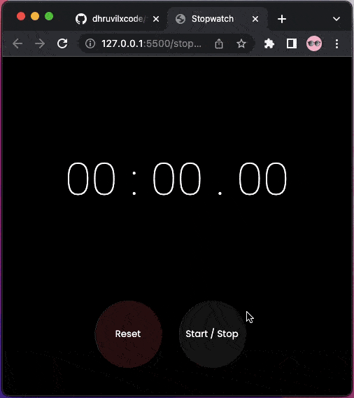

[View Source](./stopwatch-app/)
[Live Preview](https://dhruvil-fsjs-assignment-2.netlify.app/stopwatch-app/)

# 2. Countdown App:
Build a countdown app which takes the start position from the user and on reaching zero,the countdown stops.

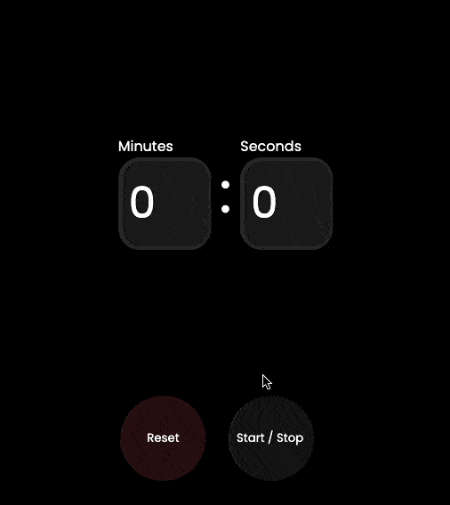

[View Source](./countdown-app/)
[Live Preview](https://dhruvil-fsjs-assignment-2.netlify.app/countdown-app/)

# 3. Word Count App:
Build a word count app which only calculates the number of characters given by the user.

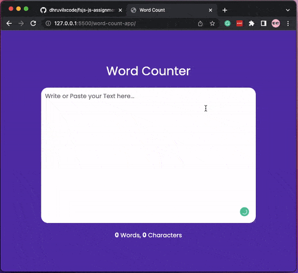

[View Source](./word-count-app/)
[Live Preview](https://dhruvil-fsjs-assignment-2.netlify.app/word-count-app/)

# 4. To-do App:
Build a simple todo app which adds tasks,edit the tasks and also delete the tasks.

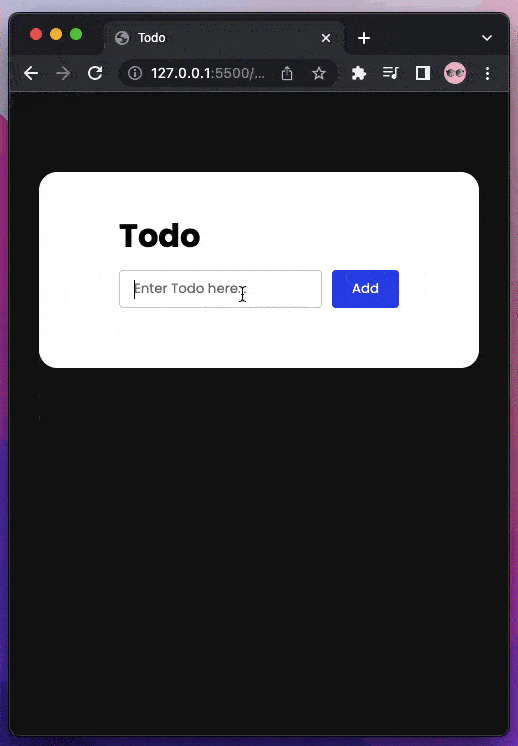

[View Source](./todo-app/)
[Live Preview](https://dhruvil-fsjs-assignment-2.netlify.app/todo-app/)

# 5. Typing Game:
On clicking on start typing the counter starts and displays the time the user takes to type.

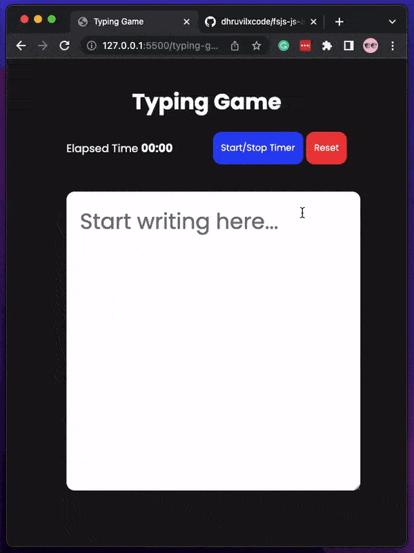

[View Source](./typing-game/)
[Live Preview](https://dhruvil-fsjs-assignment-2.netlify.app/typing-game/)

# 6.  Drum kit :
Build a drum kit app in which players can make a corresponding drum noise by pressing each key.

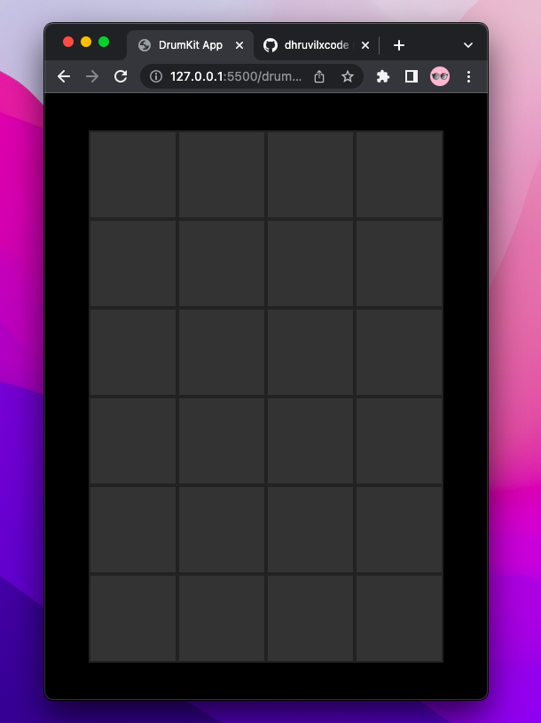

[View Source](./drum-kit-app/)
[Live Preview](https://dhruvil-fsjs-assignment-2.netlify.app/drum-kit-app/)

# 7. Bookmark App:
Create a bookmark app which helps us to store different website links using local storage. There is a section where we find all the saved bookmarks.
**Extra: Create Chrome Extension**

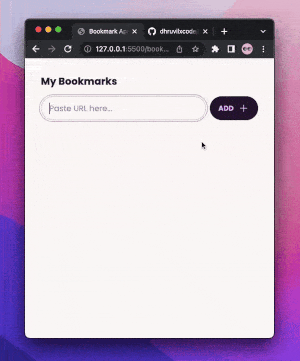

[View Source](./bookmark-app/)

    
How to install Chrome Extension?

1. Download the following folder [Click here](./bookmark-app/chrome-extension-src/)
2. Open Chrome Extensions Manager [chrome://extensions/](chrome://extensions/)
3. Turn on Developer Mode
4. Click on Load Unpacked, and select downloaded folder.

 

[Live Preview](https://dhruvil-fsjs-assignment-2.netlify.app/bookmark-app/)

# 8. Random Quote Generator:
Build a Quote generator app on each refresh that gives us different quotes.

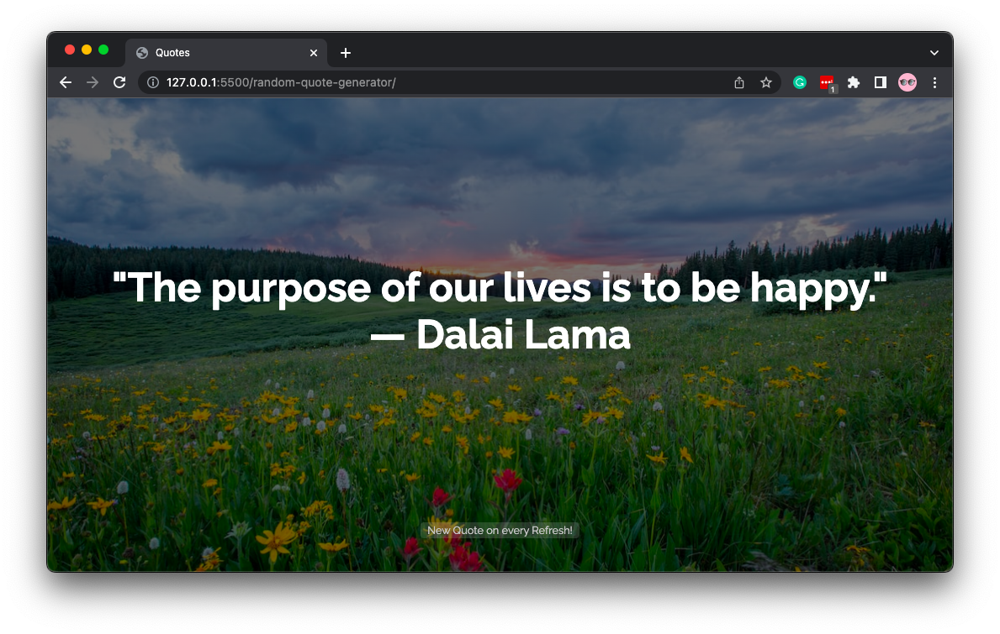

[View Source](./random-quote-generator/)
[Live Preview](https://dhruvil-fsjs-assignment-2.netlify.app/random-quote-generator/)

# 9. Loan Calculator (Home, Car, Bike Personal):
It will calculate the monthly emi of home/car/Bike by taking the total amount, months to repay and the rate of interest.

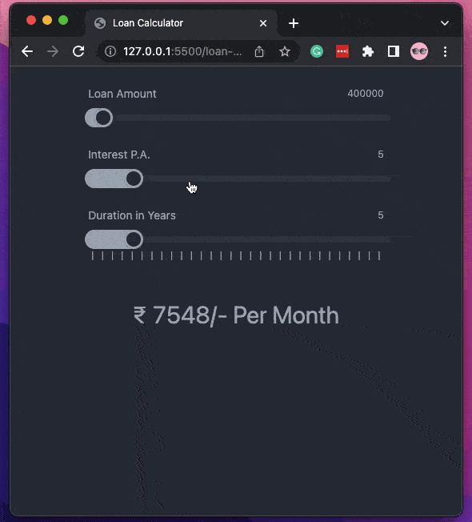

[View Source](./loan-calculator/)
[Live Preview](https://dhruvil-fsjs-assignment-2.netlify.app/loan-calculator/)

# 10. Clipboard:
Whenever a user wants to store something in the clipboard, he enters in the textbox  and on clicking on submit button, it will save in the clipboard.

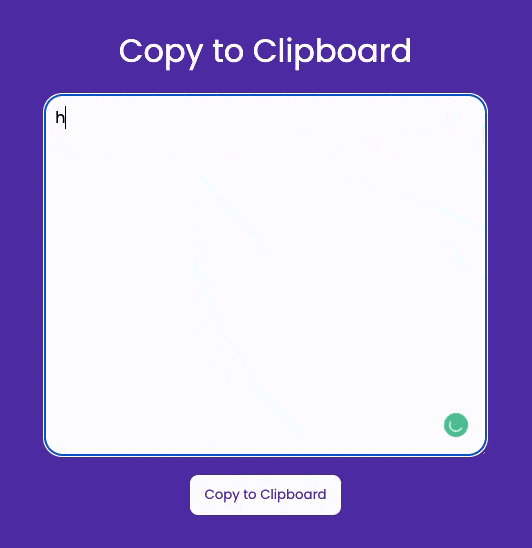

[View Source](./clipboard-app/)
[Live Preview](https://dhruvil-fsjs-assignment-2.netlify.app/clipboard-app/)

# 11. Hex Code for Selected Colour:
When a user selects any particular colour, it shows the Hex code .

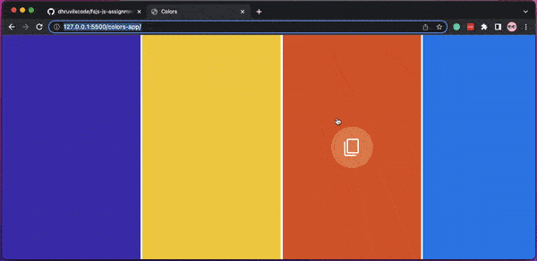

[View Source](./colors-app/)
[Live Preview](https://dhruvil-fsjs-assignment-2.netlify.app/colors-app/)
