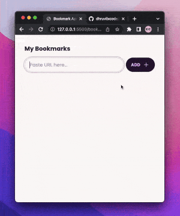

# Bookmark App

## Developer
[Dhruvil Patel](https://github.com/dhruvilxcode)

## My Learnings
Used LocalStorage to store data, explored how to create Chrome Extension, and nailed down the process. Scroll down to see how to use Chrome extension.

## Completion Time
7 Hours

## Live Preview
[https://dhruvil-fsjs-assignment-2.netlify.app/stopwatch-app/](https://dhruvil-fsjs-assignment-2.netlify.app/stopwatch-app/)

## Screenshot

## Chrome Extension

    
How to install Chrome Extension?

1. Download the following folder [Click here](./bookmark-app/chrome-extension-src/)
2. Open Chrome Extensions Manager [chrome://extensions/](chrome://extensions/)
3. Turn on Developer Mode
4. Click on Load Unpacked, and select downloaded folder.

 