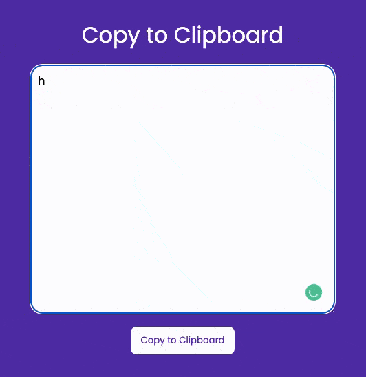

# Clipboard App

## Developer
[Dhruvil Patel](https://github.com/dhruvilxcode)

## My Learnings
Used `navigator.clipboard` to get values from clipboard and write to clipboard.

## Completion Time
20-30 Minutes

## Live Preview
[https://dhruvil-fsjs-assignment-2.netlify.app/clipboard-app/](https://dhruvil-fsjs-assignment-2.netlify.app/clipboard-app/)

## Screenshot

