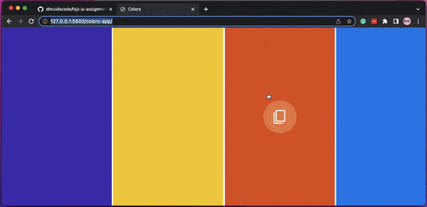

# Copy Colors App

## Developer
[Dhruvil Patel](https://github.com/dhruvilxcode)

## My Learnings
Used `navigator.clipboard` to copy the color, used eventlisteners.

## Completion Time
1-2 Hours

## Live Preview
[https://dhruvil-fsjs-assignment-2.netlify.app/colors-app/](https://dhruvil-fsjs-assignment-2.netlify.app/colors-app/)

## Screenshot

