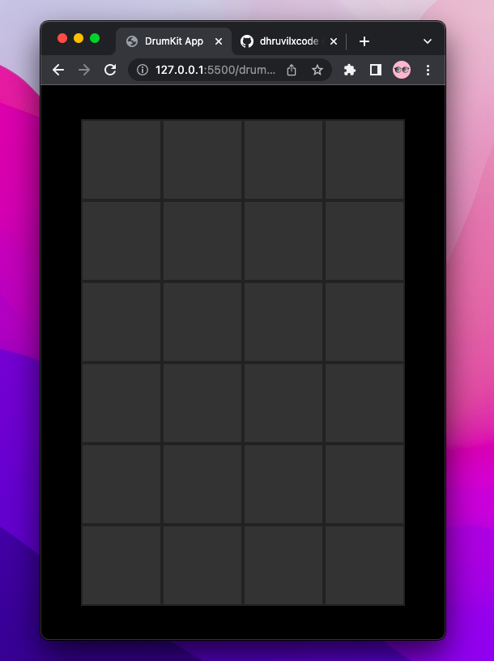

# Drum Kit App

## Developer
[Dhruvil Patel](https://github.com/dhruvilxcode)

## My Learnings
Used `document.createElement` to create tiles of Drum, and used `Audio` API to play sound.

## Completion Time
2 Hours

## Live Preview
[https://dhruvil-fsjs-assignment-2.netlify.app/drum-kit-app/](https://dhruvil-fsjs-assignment-2.netlify.app/drum-kit-app/)

## Screenshot

