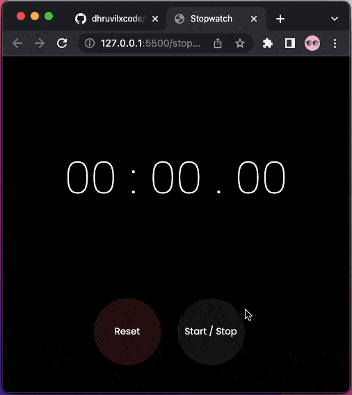

# Stopwatch App

## Developer
[Dhruvil Patel](https://github.com/dhruvilxcode)

## My Learnings
Used `setInterval` for stopwatch mechanism

## Completion Time
1 Hour

## Live Preview
[https://dhruvil-fsjs-assignment-2.netlify.app/stopwatch-app/](https://dhruvil-fsjs-assignment-2.netlify.app/stopwatch-app/)

## Screenshot

